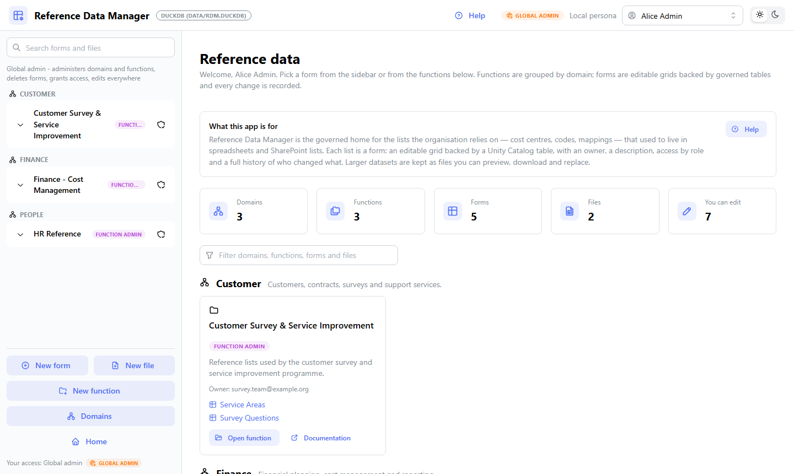
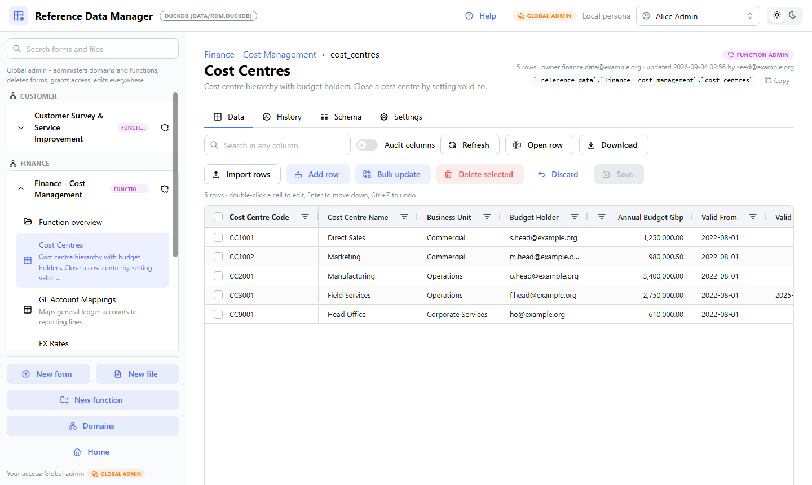
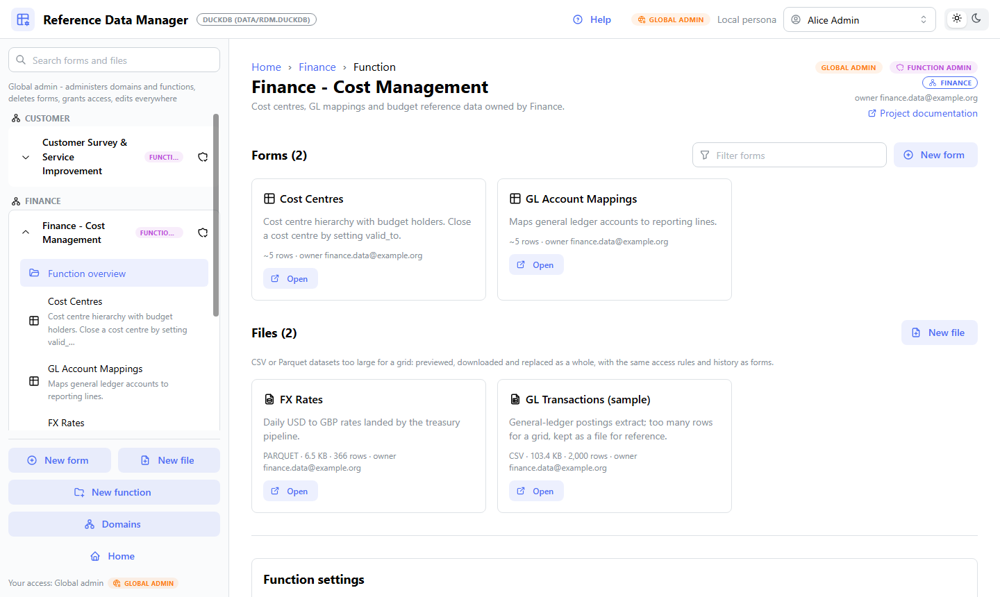
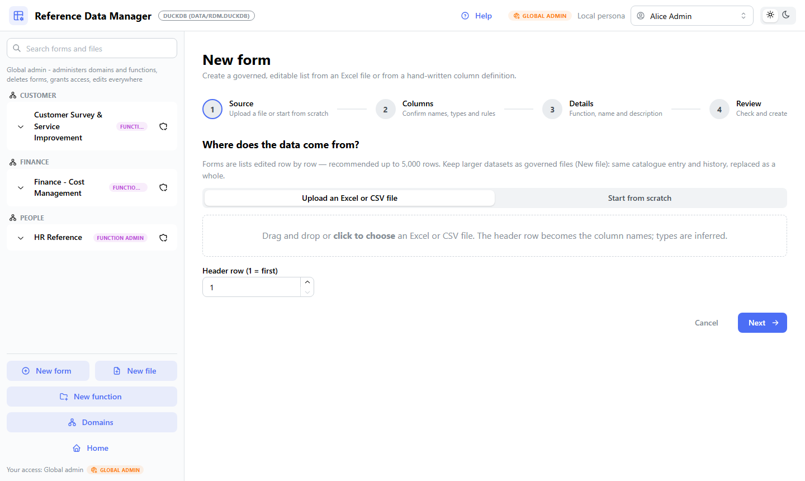
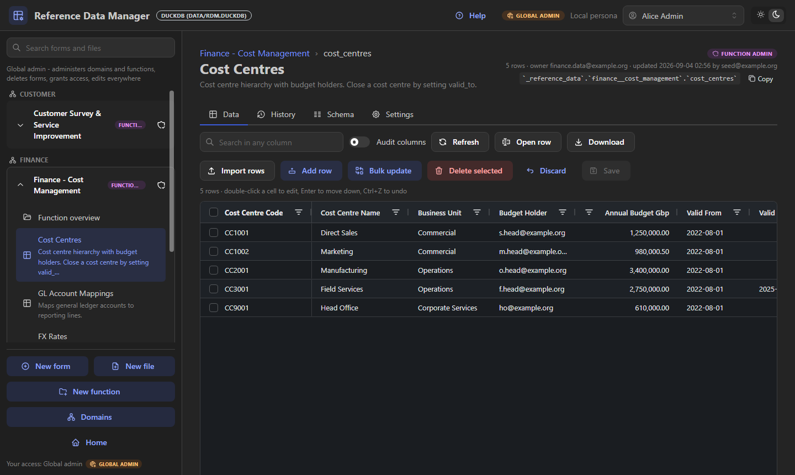

# Reference Data Manager

[](https://github.com/roanboc/dbx-reference-data-manager/actions/workflows/ci.yml)


Business-owned reference data on Databricks - governed, audited and edited in the browser,
so the lists that drive reports and pipelines stop living in SharePoint and spreadsheets.

**Try it in two minutes, with no Databricks account:** `make install && make seed && make run`
starts the whole app on a local DuckDB file with demo content and four switchable personas.
See [Quick start](#quick-start-local-duckdb).



## Why it exists

Every organisation runs on small business-owned lists: cost centres, mappings,
classifications, rates, service areas. When they live in SharePoint lists or spreadsheets,
every consumer keeps a copy, nobody can say which version a report used, and data engineers
re-ingest them by hand. This app makes Unity Catalog their single home:

* **One source of truth** - every list is a governed Delta table (a *form*) or a governed
  CSV/Parquet file, addressable as `` `catalog`.`schema`.`object` `` by every pipeline,
  notebook and report, with copy-ready query snippets in the UI.
* **Governance by the platform, not the app** - access is the schema's Unity Catalog
  grants, and with on-behalf-of-user authorization every query runs as the signed-in user.
  The app only decides what to render; Unity Catalog enforces.
* **Full auditability** - a row-level change log records who changed what (before/after
  values), and Delta Change Data Feed feeds downstream SCD Type 2 pipelines.
* **Business self-service** - data stewards maintain their own lists in an editable grid;
  administrators create new forms from an Excel file in minutes, no ticket to data
  engineering required.

## Governance model

The hierarchy is **domain > function > form | file**: a *domain* is a business classifier
aligned with the organisation's data domains, a *function* is a Unity Catalog schema, a
*form* is a governed Delta table and a *file* is a CSV/Parquet dataset in the function's
`_files` volume (for lists too large to edit in a grid). The app is metadata-driven: it
discovers domains, functions, forms and files at runtime.

| Role | Scope | What they do |
|---|---|---|
| Viewer | one function | Browse and export lists |
| Editor | one function | Edit rows, upload and replace files |
| Function admin | one function | Editor + create forms and volumes, manage the function's grants |
| Global admin | the catalog | Create functions, maintain the domain list, delete functions and forms |

* Roles are resolved from Unity Catalog privileges and granted to **account groups only**;
  the bundle (`resources/*.yml`) is the single place where grants are declared.
* Deletes are restricted to global admins, need a typed confirmation and never cascade; the
  Databricks backend refuses any statement or file path outside the reference-data catalog
  ([docs/DESIGN.md](docs/DESIGN.md) §11).
* Every domain, function, form and file carries a display name, description, owner and
  documentation link in the `_catalog` registry, so consumers know what a list means and
  who answers for it.

## What users get

* **Editable grid** (AG Grid): inline editing, sorting and filtering while editing,
  dropdowns for constrained values, cell-level validation highlighting, add/delete rows,
  bulk update of selected rows, one atomic save, optimistic concurrency (`_version`),
  CSV/Excel export, Excel/CSV row import.
* **Item form**: one row in a dialog for wide lists, with the row's own history and a
  *Restore* per version; deleted rows are restored from the History tab.
* **Files**: CSV/Parquet datasets (thousands to millions of rows) kept in a volume per
  function, with preview, inferred columns, download, replace and upload history; uploads
  are parsed and row-counted before they are accepted, and files landed by pipelines appear
  automatically.
* **Import modes**: append, merge or replace on the business key, previewed and validated
  like grid edits and saved through the same atomic change set.
* **Domain overview**: one page per domain with its functions, forms and files, each with
  its Databricks path and copy-ready query snippets.
* **Administrator tools**: create a form from an Excel file (types inferred, adjustable),
  edit descriptions / required flags / business keys / allowed values, add and remove columns.
  A description and an owner are mandatory on every function, form and file, so nothing
  governed is left unexplained; the creator warns when a list is too large for a grid and
  offers a governed file instead.
* **History**: row-level audit trail plus Delta Change Data Feed for downstream pipelines,
  and an optional per-form Type 2 history table (`_h__<form>` with `__START_AT` /
  `__END_AT`) in the Databricks Auto CDC convention.
* **Help**: an *About* tab for anyone in the organisation, the user guide, the form-building
  guide and (for global admins) the Databricks administration guide.
* **Light and dark mode**: a header switch chooses light or dark, starting from the
  operating system's scheme; the choice is remembered per browser. Long actions show a
  spinner on the button that started them and cannot be submitted twice.

## Screenshots

The home page above shows the catalogue grouped by domain; the rest of the app:

| Editing a form | A function with its forms and files |
|---|---|
|  |  |

| Creating a form from Excel | Dark mode |
|---|---|
|  |  |

Regenerate with `python scripts/screenshots.py` while `python app.py --dev` is running.

## Architecture at a glance

The UI never contains SQL (repository pattern): pages talk to a `DatabaseBackend`
interface, `DuckDBBackend` runs locally with zero infrastructure and `DatabricksBackend`
runs on a SQL warehouse with on-behalf-of-user authorization. How a save works:

1. The grid tracks edits per row in a browser-side draft with the `_version` each row had
   when loaded; every edit is validated server-side and Save stays disabled until the draft
   is clean.
2. Save turns the draft into a `ChangeSet`: one transaction on DuckDB, one `MERGE` (whose
   source is a single JSON parameter) on Databricks. Rows whose `_version` changed since
   loading are reported as conflicts and never overwritten.
3. Every change lands in the audit log (`_catalog.change_log`) and appears in History, per
   form and per row.

Framework: **Dash + Dash AG Grid + Dash Mantine Components**. Start with
[docs/FUNCTIONAL_DESIGN.md](docs/FUNCTIONAL_DESIGN.md) for the business, data and process
view; the framework rationale (versus Streamlit, kept in the upstream git history) is in
[docs/FRAMEWORK_DECISION.md](docs/FRAMEWORK_DECISION.md).

## Quick start (local, DuckDB)

```bash
make install            # creates .venv and installs requirements-dev.txt
make seed               # creates data/rdm.duckdb (+ data/files/) with demo domains, functions, forms and files
make run                # http://localhost:8050 (dev server with hot reload)
```

Demonstrating it to someone? Use `make serve` instead: `make run` starts the Dash dev server,
which shows the debug toolbar and renders a Werkzeug traceback into the page when something
goes wrong. `make serve` runs the same app under gunicorn, as it runs in production.

On Windows, the same without make:

```powershell
python -m venv .venv; .\.venv\Scripts\pip install -r requirements-dev.txt
.\.venv\Scripts\python scripts\seed_demo.py
.\.venv\Scripts\python app.py --dev
```

Switch persona in the header (Alice Admin / Fiona Function-admin / Eddie Editor / Vera
Viewer) to see the role-dependent navigation and controls. Settings come from `.env` (see
`.env.example`); `python scripts/seed_demo.py --reset` recreates the demo content.

## Deploying to Databricks

Everything the app needs in a workspace - the Unity Catalog catalog, the function schemas
with their grants, the SQL-warehouse binding and the app itself - is declared in
`databricks.yml` and `resources/*.yml`. Every value that depends on your workspace is a
bundle variable with a placeholder default: fill in the workspace host, the warehouse id
and your admin groups in the `dev` target, then

```bash
databricks bundle deploy -t dev --profile <your profile>
databricks bundle run reference_data_manager -t dev --profile <your profile>
```

Enable user authorization (`sql` scope) so queries run as the signed-in user and Unity
Catalog enforces the roles. Domains are created in the app by a global admin (**Domains**
in the sidebar) and referenced from the bundle through the `rdm.domain` schema property.
To surface functions under the workspace **Discover** page's domains
(`domain:<Name>` in search), sync the matching governed tags with
`python scripts/sync_domain_tags.py` ([docs/DEPLOYMENT.md](docs/DEPLOYMENT.md) §10).
The full walkthrough, grants and troubleshooting are in
[docs/DEPLOYMENT.md](docs/DEPLOYMENT.md).

## Testing

```bash
make test               # pytest: unit, backend contract (DuckDB), Dash server smoke
make lint               # ruff
```

The same contract also runs against a real SQL warehouse
([docs/DEPLOYMENT.md](docs/DEPLOYMENT.md) §7) - point it at a dev catalog only:

```bash
RDM_TEST_DATABRICKS=1 RDM_CATALOG=<your dev catalog> \
DATABRICKS_WAREHOUSE_ID=<id> DATABRICKS_CONFIG_PROFILE=<your profile> \
python -m pytest tests/test_databricks_live.py
```

## Repository layout

```
app.py                    Dash entrypoint (python app.py --dev | python app.py = gunicorn)
app.yaml                  Databricks Apps runtime configuration
databricks.yml, resources/  Databricks Asset Bundle: catalog, function schemas + grants, app
src/rdm/
  models.py               Domain model: DataType, ColumnDef, FormDef, FunctionDef, DomainDef, Role, ChangeSet ...
  coercion.py             Value coercion shared by grid edits, imports and backends
  backend/base.py         DatabaseBackend interface (the only place SQL is allowed)
  backend/duckdb_backend.py      Local backend (emulates UC metadata in _catalog)
  backend/databricks_backend.py  SQL warehouse backend (MERGE via from_json, audit table)
  auth/provider.py        MockAuthProvider (personas) / DatabricksAuthProvider (headers)
  services/               FormService, CatalogService, Draft (row-id edit tracking, bulk update,
                          restore), Excel import, file upload helpers
  ui/                     Dash app: shell, routing, pages (home, function, domains, form, file,
                          wizard, help), AG Grid configuration
tests/                    pytest suite (see docs/DESIGN.md §9 for the testing strategy)
scripts/                  seed_demo.py (local demo content), screenshots.py (README images),
                          sync_domain_tags.py (Discover domain assignments)
docs/                     FUNCTIONAL_DESIGN.md (business, data, process), DESIGN.md (technical),
                          FRAMEWORK_DECISION.md, DEPLOYMENT.md, images/
```

## Notes and limitations

* Icons are loaded at runtime from the Iconify CDN (`dash-iconify`); in a network without
  internet access from the browser they simply do not render, the labels remain.
* AG Grid Community is used (no licence). Multi-cell clipboard paste is an AG Grid Enterprise
  feature; use *Bulk update* or *Import rows* for bulk changes.
* The grid loads at most `RDM_MAX_ROWS` rows per form (default 5000); keep larger lists as
  files in the function's volume.
* DuckDB allows a single writer process, so `python app.py` runs one gunicorn worker locally
  and `RDM_WORKERS` (default 2) against Databricks.

## Documentation

| Document | Audience |
|---|---|
| [docs/FUNCTIONAL_DESIGN.md](docs/FUNCTIONAL_DESIGN.md) | Business, data and process view - what the app manages and for whom |
| [docs/DESIGN.md](docs/DESIGN.md) | Technical design - backend contract, security review, testing strategy |
| [docs/DEPLOYMENT.md](docs/DEPLOYMENT.md) | Deploying, grants, user authorization, troubleshooting |
| [docs/FRAMEWORK_DECISION.md](docs/FRAMEWORK_DECISION.md) | Why Dash + AG Grid (versus Streamlit) |

## Contributing

Branch from `main`, keep `make lint` and `make test` green, and open a pull request - CI
runs ruff and the full test suite on every push, with no credentials needed. Changes to the
Databricks backend or the bundle should also pass the live contract suite against a
throwaway dev catalog before release ([docs/DEPLOYMENT.md](docs/DEPLOYMENT.md) §7).

## Support

This is an open-source project offered as-is. The in-app **Help > About** tab names the
contact for new use cases in your own deployment (set through `RDM_ADMIN_CONTACT`).

## License

Apache License 2.0 - see [LICENSE](LICENSE).

