# Reference Data Manager for Databricks

[](https://github.com/roanboc/dbx-reference-data-manager/actions/workflows/ci.yml)
[](pyproject.toml)
[](docs/DEPLOYMENT.md)
[](docs/FRAMEWORK_DECISION.md)
[](https://github.com/astral-sh/ruff)
[](LICENSE)

**One governed home for the reference data your reports, models and pipelines depend on.**
The Reference Data Manager is a Databricks App that replaces SharePoint lists and personal
spreadsheets as the place where business users maintain code lists, mappings, hierarchies,
rates and parameters. Every list becomes a governed Delta table in Unity Catalog, edited by
the people who know the business, with access by role, validation on every change and a
complete, restorable history.

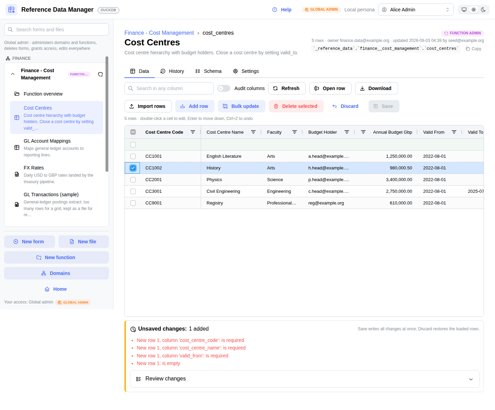

- [Why](#why)
- [What you get](#what-you-get)
- [Governance model](#governance-model)
- [Screenshots](#screenshots)
- [Architecture](#architecture)
- [Getting started](#getting-started)
- [Configuration](#configuration)
- [Development](#development)
- [Documentation](#documentation)
- [Roadmap](#roadmap)
- [Contributing, security and licence](#contributing-security-and-licence)

## Why

Reference data tends to live in many places, in many versions, with no trail and a lot of
re-keying: SharePoint lists, spreadsheets, e-mails and values hard-coded in pipelines. It is
copied into the data platform by hand, ownership is unclear and the lists cannot be joined
reliably with lakehouse data.

| Goal | How the app delivers it |
|---|---|
| One governed home | Every list has a domain, a function, an owner and a description, registered in the catalogue and visible in Catalog Explorer |
| Business users maintain their own lists | Editors change rows in a grid without a data engineer; function admins create new lists from an Excel file |
| Trustworthy history | Every change is attributable (who, when, before, after); nothing is silently overwritten; any version of a row can be restored |
| Platform-native governance | Access is Unity Catalog grants to groups; the app runs every statement as the signed-in user and never holds broader rights |
| Downstream reuse | Pipelines read the tables directly; Change Data Feed feeds SCD Type 2 dimensions |

## What you get

**For data stewards and editors**

- An editable grid (AG Grid): inline editing, dropdowns for allowed values, sort and filter
  while editing, add and delete rows, bulk update of selected rows, undo, server-side search.
- Validation before anything is written: types, required values, allowed values, unique
  business keys. Problem cells are highlighted and Save stays disabled until the draft is clean.
- One atomic save per draft with optimistic concurrency: a row changed by someone else since
  it was loaded is reported, never overwritten.
- An item form for wide lists (one row in a dialog) with the row's own history and a
  *Restore* per version; deleted rows come back from the History tab.
- Excel and CSV in and out: export what you see or the whole list; import rows into an
  existing form with headers matched by name.
- Files for datasets too large for a grid (CSV or Parquet, thousands to millions of rows):
  preview, inferred columns, download, replace, upload history; files landed by pipelines
  appear automatically.

**For function administrators**

- Create a form from an Excel file in a four-step wizard: types inferred and adjustable,
  descriptions, required flags, business keys, allowed values, optional initial load.
- Change a form's definition later: descriptions, rules, add and remove columns.
- Grant Viewer, Editor or Function admin to groups from the function page.

**For the data platform team**

- A domain > function > form | file hierarchy aligned with the organisation's data domains,
  maintained in the app and recorded on the Unity Catalog objects as properties and tags.
- Copy-ready Databricks paths and query snippets (`SELECT`, `table_changes`, `read_files`)
  on every form and file page.
- A registry (`_catalog.domains`, `functions`, `forms`, `files`) and a row-level audit trail
  (`_catalog.change_log`) next to Delta Change Data Feed.
- Infrastructure as code: catalog, schemas, grants and the app are declared in a Databricks
  Asset Bundle and deployed by CI.
- Light and dark colour schemes (follows the system by default), no runtime dependency on
  any CDN, and an in-app help with an *About* page written for the whole organisation.

## Governance model

The hierarchy is **domain > function > form | file**. A *domain* is a business classifier
(Finance, People, Student, ...). A *function* is a Unity Catalog schema and the level at
which access is granted. A *form* is one Delta table edited in a grid; a *file* is a CSV or
Parquet dataset in the function's `_files` volume. The catalog is `_reference_data`.

| Role | Held on | Can |
|---|---|---|
| **Viewer** | function | Open forms and files, search, sort, filter, open a row, export, download, read history |
| **Editor** | function | Viewer + add, change and delete rows, bulk update, import rows, restore versions, replace files |
| **Function admin** | function | Editor + create forms and files, change definitions, edit function details, grant roles to groups |
| **Global admin** | catalog | Everything, plus create and delete functions, assign domains, maintain the domain list, delete forms and files |

Roles are resolved from Unity Catalog privileges inside the user's own SQL session
(`information_schema` with `is_account_group_member`), so nested account groups work and
nothing depends on a request header. Access is granted to **groups only**.

| Role | Unity Catalog privileges on the function schema (plus `USE CATALOG`) |
|---|---|
| Viewer | `USE SCHEMA`, `SELECT`, `READ VOLUME` |
| Editor | Viewer + `MODIFY`, `WRITE VOLUME` |
| Function admin | Editor + `CREATE TABLE`, `CREATE VOLUME`, `MANAGE`, `APPLY TAG` |
| Global admin | `CREATE SCHEMA` and `MANAGE` on the catalog (or catalog ownership) |

**Guarantees the app adds on top of Unity Catalog** (see [docs/DESIGN.md](docs/DESIGN.md) §11):

- Every save is one atomic, version-checked write; every change is logged with before and
  after images and shown in History, per form and per row.
- Only global admins delete, always with a typed confirmation, one object at a time; nothing
  cascades. A function is deleted only when it holds no forms and its volume is empty.
- The Databricks backend refuses any statement or volume path that leaves the configured
  catalog, and every identifier is validated and quoted, every value bound as a parameter.
- Deleted forms stay recoverable through Delta history; audit entries are kept.

## Screenshots

| | |
|---|---|
| 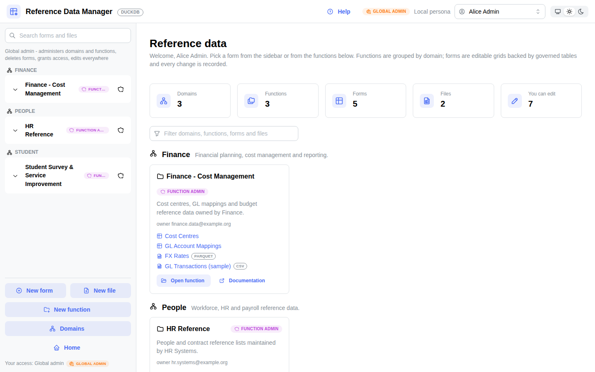 Home: what you can see and edit, grouped by domain | 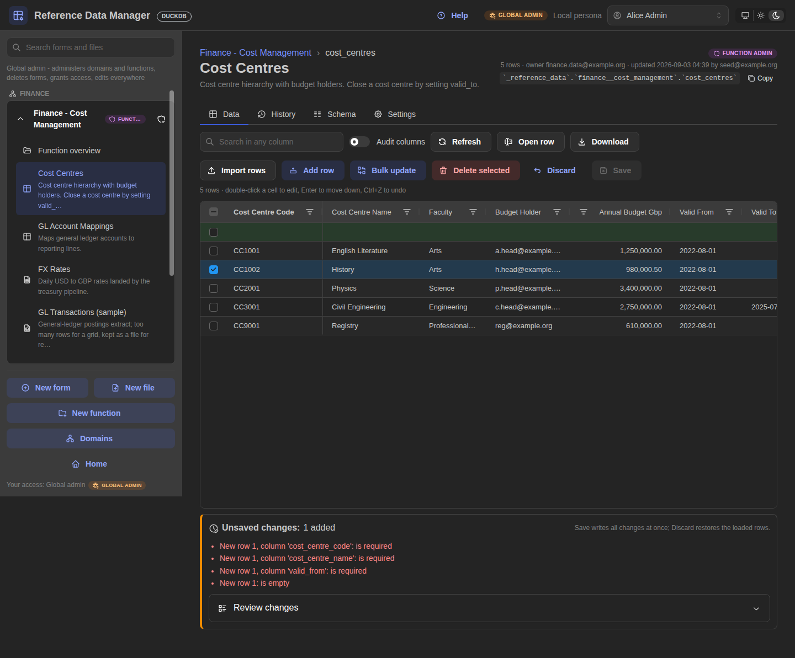 The same form in the dark colour scheme |
| 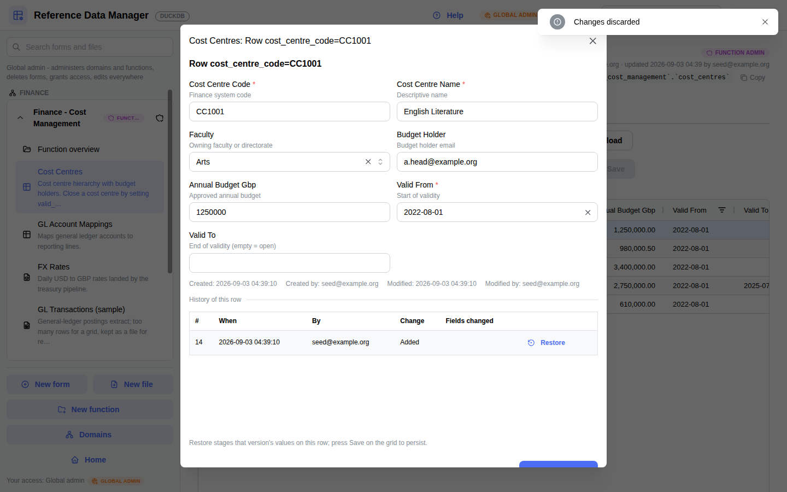 Item form: one row, its history, restore any version | 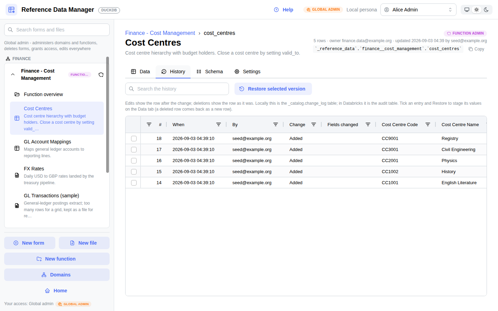 History: who changed what, before and after |
| 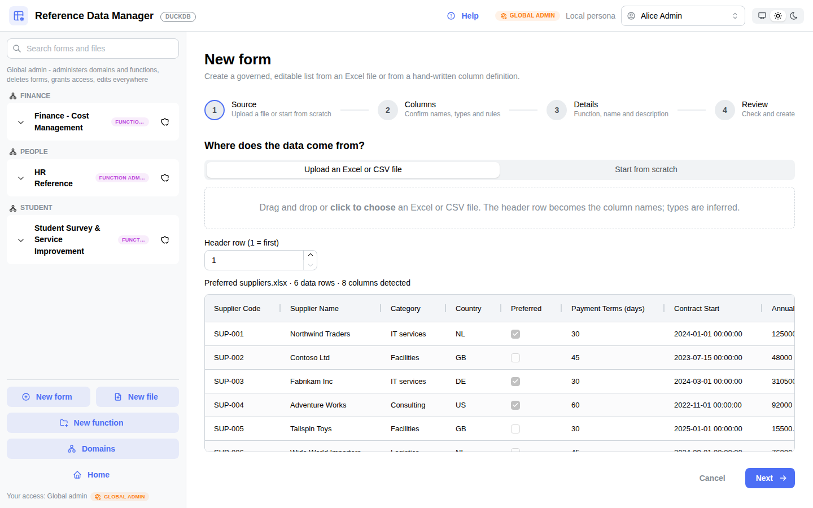 New form: upload an Excel file or start from scratch | 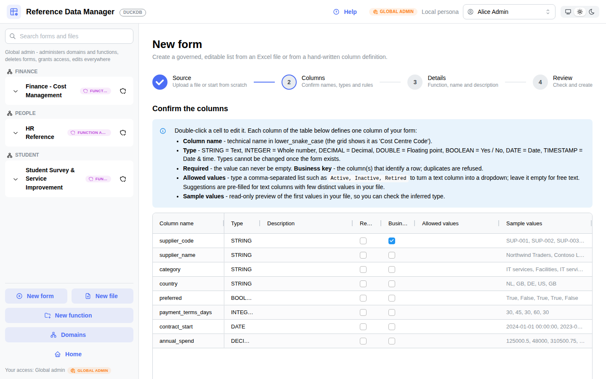 Confirm inferred names, types, keys and allowed values |
| 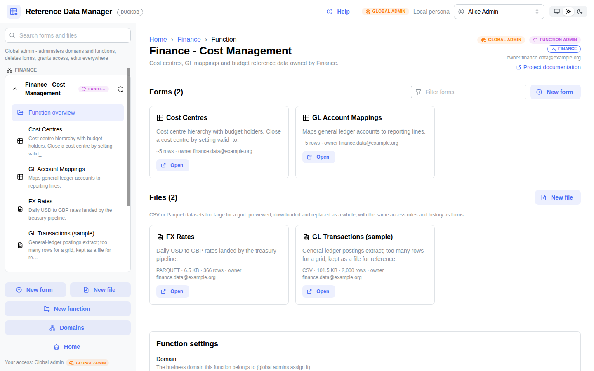 Function: forms, files, settings and access | 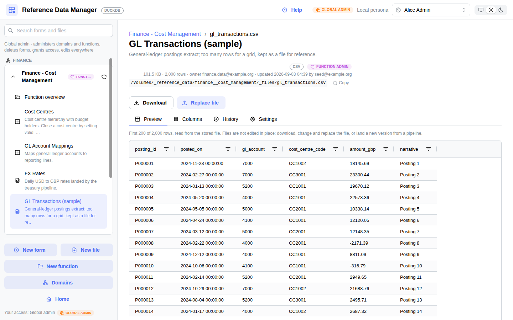 File: preview, columns, download, replace, history |
| 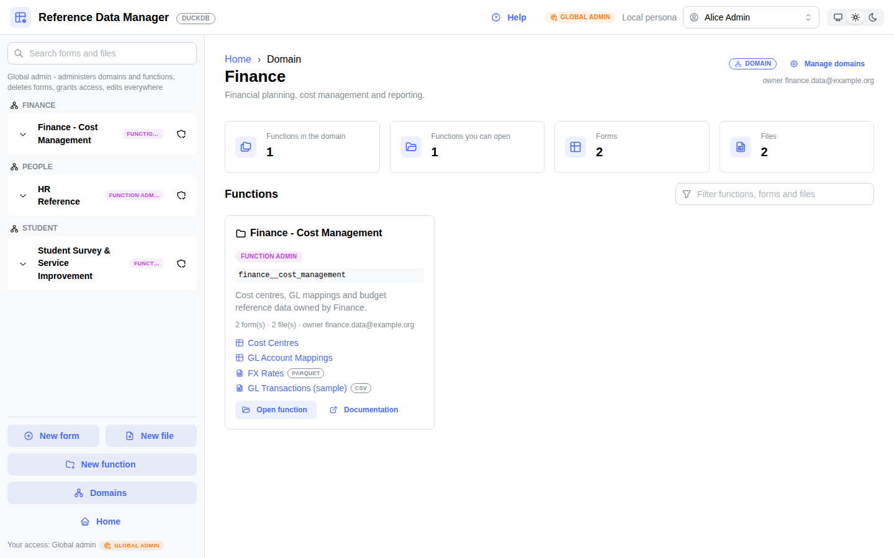 Domain overview with copy-ready Databricks paths | 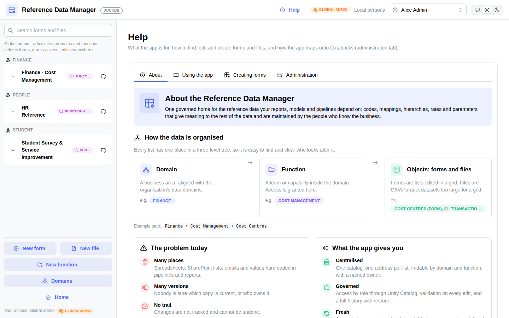 Help > About, written for everyone in the organisation |

## Architecture

```
browser ──> Databricks Apps proxy ──> Dash app (gunicorn)
             identity headers +          │  UI never contains SQL
             user access token           ▼
                                   FormService / CatalogService / Draft
                                          │
                                   DatabaseBackend interface
                                   ├── DatabricksBackend  SQL warehouse, runs AS THE USER
                                   │                      Unity Catalog enforces the grants
                                   └── DuckDBBackend      local development and tests
```

- **Framework**: Dash + Dash AG Grid (Community) + Dash Mantine Components; the rationale
  versus Streamlit is in [docs/FRAMEWORK_DECISION.md](docs/FRAMEWORK_DECISION.md).
- **Repository pattern**: the UI calls services, services call a `DatabaseBackend`. The
  Databricks implementation sends each save as a single `MERGE` fed by one JSON parameter;
  the DuckDB implementation wraps it in a transaction and emulates Unity Catalog metadata.
- **Identity**: Databricks Apps user authorization (scopes `sql`, `files.files`,
  `iam.current-user:read`); locally a persona switcher with one user per role.
- **Metadata-driven**: domains, functions, forms and files are discovered at runtime; grids
  and item forms are rendered from the column definitions.

## Getting started

### Locally, in five minutes (DuckDB, no Databricks needed)

```bash
make install            # creates .venv and installs requirements-dev.txt
make seed               # data/rdm.duckdb (+ data/files/) with demo domains, functions, forms and files
make run                # http://localhost:8050 (dev server with hot reload)
```

Switch the persona in the header (Alice Admin, Fiona Function-admin, Eddie Editor, Vera
Viewer) to see the role-dependent navigation and controls. Settings come from `.env`
(copy `.env.example`). `python scripts/seed_demo.py --reset` recreates the demo content.

### On Databricks

[docs/DEPLOYMENT.md](docs/DEPLOYMENT.md) walks through it. In short: set the workspace host
and warehouse in `databricks.yml`, then

```bash
databricks bundle validate -t dev
databricks bundle deploy   -t dev          # catalog, function schemas + grants, app
databricks bundle run reference_data_manager -t dev
```

Enable **user authorization** on the app so that every query runs as the signed-in user and
Unity Catalog enforces the roles. Production deploys run from `main` through
[`.github/workflows/ci.yml`](.github/workflows/ci.yml) with a service principal.

## Configuration

| Variable | Default | Purpose |
|---|---|---|
| `RDM_BACKEND` | `duckdb` | `duckdb` (local file) or `databricks` (SQL warehouse) |
| `RDM_AUTH` | `mock` locally, `databricks` with the Databricks backend | Identity: persona switcher or the Apps proxy headers |
| `RDM_PERSONA` | `admin` | Default persona for the mock provider |
| `RDM_DUCKDB_PATH` | `data/rdm.duckdb` | Local database file (files go next to it) |
| `RDM_CATALOG` | `_reference_data` | Unity Catalog catalog (also the bundle variable `catalog`) |
| `DATABRICKS_WAREHOUSE_ID` | injected by the app resource | SQL warehouse; `DATABRICKS_HTTP_PATH` overrides it |
| `RDM_MAX_ROWS` | `5000` | Rows loaded into the grid per form (server-side search beyond) |
| `RDM_MAX_FILE_MB` | `200` | Largest file accepted through the browser upload |
| `RDM_METADATA_CACHE_TTL` | `60` | Seconds to cache navigation and permissions per user |
| `RDM_ADMIN_CONTACT` | empty | E-mail, URL or text shown in Help > About as the contact for other use cases |
| `RDM_WORKERS` | `2` | gunicorn workers on Databricks (DuckDB always runs one) |

Production values live in `app.yaml` and `resources/app.yml` (keep them in sync); local
values in `.env` (never committed).

## Development

```
app.py                    Entrypoint: gunicorn (Databricks Apps) or the Dash dev server (--dev)
app.yaml                  Databricks Apps runtime configuration
databricks.yml, resources/  Asset bundle: catalog, function schemas + grants, app
assets/                   CSS, colour-scheme and sidebar scripts, vendored Tabler icons
src/rdm/
  models.py, coercion.py  Domain model and value coercion shared by grid, imports and backends
  config.py               Settings from the environment (.env locally)
  backend/                DatabaseBackend interface, DuckDB and Databricks implementations, SQL helpers
  auth/                   Mock personas (local) and the Databricks Apps identity provider
  services/               Navigation, role guards, drafts and change sets, Excel import, files
  ui/                     Dash shell, routing, pages, AG Grid configuration, in-app help
scripts/                  seed_demo.py, vendor_icons.py, screenshots.py
tests/                    Unit, backend contract (DuckDB), Databricks SQL generation, Dash server, browser
docs/                     Functional design, technical design, framework decision, deployment guide
```

```bash
make check              # ruff + pytest
make browsers           # Chromium for the Playwright smoke tests (they skip without it)
make icons              # re-vendor the Tabler icons after adding one to the UI
make screenshots        # regenerate docs/screenshots from a running local app (make serve)
```

The test strategy is described in [docs/DESIGN.md](docs/DESIGN.md) §9: the DuckDB backend is
the local runtime and contract target, the Databricks backend is covered by SQL-generation
tests against a fake connection and, before a release, by a manual walk-through against a
development catalog ([docs/DEPLOYMENT.md](docs/DEPLOYMENT.md) §7).

Notes

- AG Grid Community is used (no licence). Multi-cell clipboard paste is an Enterprise
  feature; *Bulk update* and *Import rows* cover bulk changes.
- DuckDB allows a single writer process, so the local server runs one gunicorn worker.
- Icons are Tabler icons vendored under `assets/icons/`; nothing is fetched from a CDN at
  runtime, so the app renders fully inside locked-down networks.

## Documentation

| Document | Audience |
|---|---|
| [docs/FUNCTIONAL_DESIGN.md](docs/FUNCTIONAL_DESIGN.md) | Business owners, data stewards: scope, roles, requirements, processes, data design |
| [docs/DESIGN.md](docs/DESIGN.md) | Engineers: architecture, backend interface, authorisation, grid editing model, security review |
| [docs/DEPLOYMENT.md](docs/DEPLOYMENT.md) | Platform team: bundle configuration, user authorization, grants, CI, troubleshooting |
| [docs/FRAMEWORK_DECISION.md](docs/FRAMEWORK_DECISION.md) | ADR: Dash + AG Grid over Streamlit |
| In-app **Help** | Everyone: About, Using the app, Creating forms; Administration for global admins |

## Roadmap

- Mirror the app's domain assignment onto the workspace's native domain classification
  automatically (today the `rdm_domain` tag makes it visible and the alignment is manual).
- A guided "retire function" flow that migrates or archives forms before the schema is dropped.
- Approval workflows and lookup columns are deliberately out of scope; see
  [docs/FUNCTIONAL_DESIGN.md](docs/FUNCTIONAL_DESIGN.md) §1.

## Contributing, security and licence

Contributions are welcome: read [CONTRIBUTING.md](CONTRIBUTING.md) for the development
workflow and conventions, and [CODE_OF_CONDUCT.md](CODE_OF_CONDUCT.md). Report
vulnerabilities as described in [SECURITY.md](SECURITY.md), not in public issues.
Changes are tracked in [CHANGELOG.md](CHANGELOG.md).

Released under the [MIT licence](LICENSE). Built with [Dash](https://dash.plotly.com/),
[Dash Mantine Components](https://www.dash-mantine-components.com/),
[AG Grid Community](https://www.ag-grid.com/), [DuckDB](https://duckdb.org/) and
[Tabler Icons](https://tabler.io/icons) (MIT, see `assets/icons/tabler/LICENSE`).
