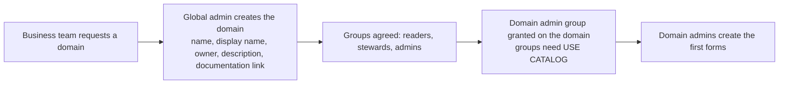
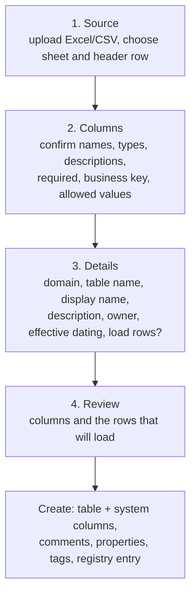
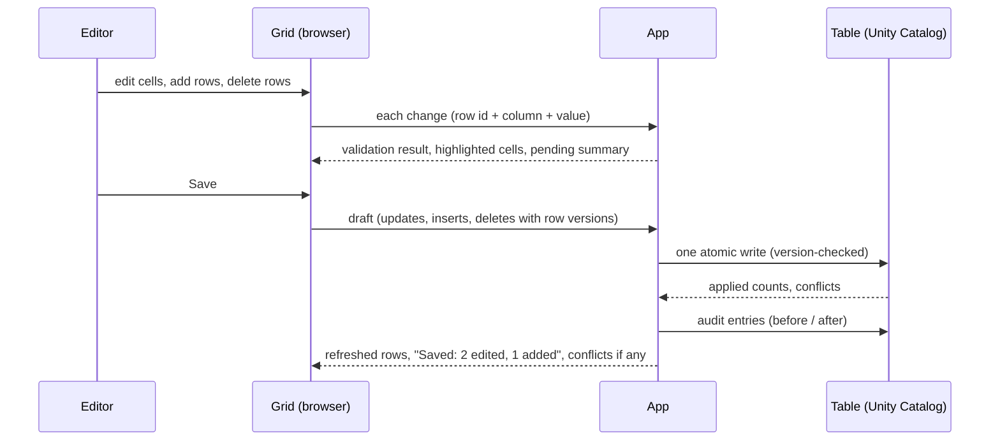
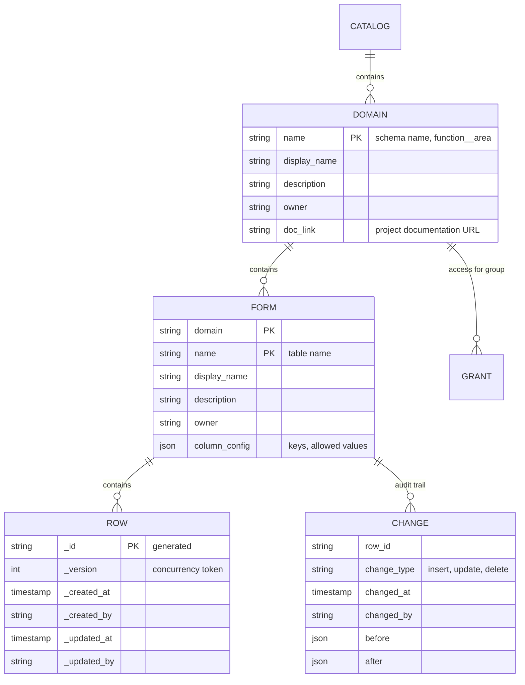
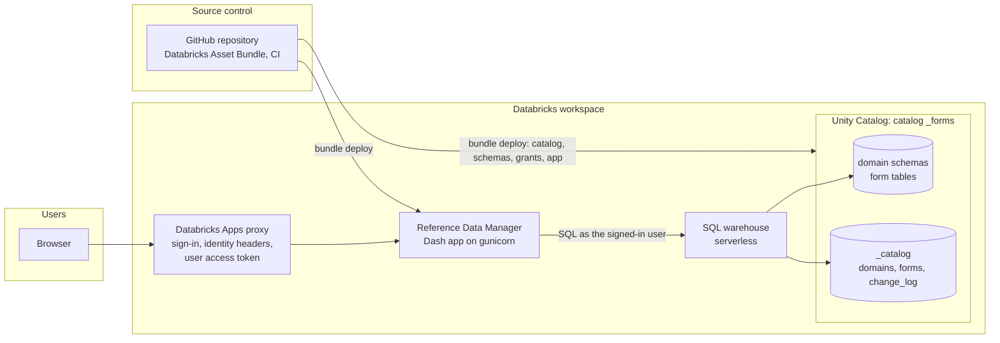

# Reference Data Manager - Functional Design

| | |
|---|---|
| Status | Working draft, maintained with the code |
| Audience | Business owners, data stewards, data engineers and contributors |
| Related | [DESIGN.md](DESIGN.md) (technical architecture), [DEPLOYMENT.md](DEPLOYMENT.md) (Databricks setup), [FRAMEWORK_DECISION.md](FRAMEWORK_DECISION.md) (UI framework), in-app **Help** |

## 1. Purpose and scope

The Reference Data Manager (also called the SCD Manager) is the single place where business
users maintain the organisation's reference data: code lists, mappings, hierarchies and
other slowly changing reference tables that today live in SharePoint lists and spreadsheets.

It replaces those lists with governed tables in the Databricks lakehouse while keeping the
experience business users know: a searchable catalogue of lists, an editable grid, Excel
in and out, and a clear record of who changed what.

In scope

* Creating, editing and retiring reference lists ("forms") per business domain.
* Access by role, granted to groups, enforced by Unity Catalog.
* Full change history and a registry of every domain and form for the data catalogue.
* Feeding downstream pipelines that build slowly changing dimensions.

Out of scope

* Large transactional or high-volume datasets (the grid is designed for lists of up to a
  few thousand rows; the row limit is configurable).
* Approval workflows and notifications (see §10, roadmap).
* Building the Type 2 dimensions themselves; the app supplies the current state and the
  change feed, pipelines derive history.

## 2. Business context

**Problem.** Reference data is spread over SharePoint lists and personal spreadsheets. It is
copied into the data platform by hand, ownership is unclear, changes are not traceable and
the lists cannot be joined reliably with lakehouse data.

**Goals**

| Goal | Measure |
|---|---|
| One governed home for reference data | Every list has a domain, an owner and a description in the catalogue |
| Business users maintain their own lists | Editors change rows without a data engineer; new lists are created from Excel by domain admins |
| Trustworthy history | Every change is attributable (who, when, before, after); no silent overwrites |
| Platform-native governance | Access is Unity Catalog grants to groups; nothing is enforced by the app alone |
| Downstream reuse | Pipelines read the tables directly and build SCD Type 2 from the change feed |

**Stakeholders**

| Stakeholder | Interest |
|---|---|
| Business teams (Finance, HR, Student services, Research, ...) | Own and maintain their lists |
| Data stewards | Data quality of the lists, descriptions, keys and allowed values |
| Data engineering (platform team) | Operates the app, the catalog and the pipelines; acts as global administrator |
| Analytics and reporting | Consume current values and history |

## 3. Glossary

| Term | Meaning |
|---|---|
| **Catalog** | The Unity Catalog catalog that holds all reference data (`_forms`). |
| **Domain** | A business function or area, e.g. *Finance - Cost Management*. One Unity Catalog schema. |
| **Form** | One reference list, e.g. *Cost Centres*. One Delta table in a domain. |
| **Row** | One entry of a list. Identified technically by `_id`; identified for people by the business key. |
| **Business key** | The column(s) that identify a row for users (a code). The app refuses duplicates. |
| **Allowed values** | A fixed list of permitted values for a text column; shown as a dropdown. |
| **Required** | A column that must always have a value. |
| **System columns** | Columns the app manages on every form: `_id`, `_version`, `_created_at/by`, `_updated_at/by`. |
| **Registry** | Tables `_catalog.domains` and `_catalog.forms` describing every domain and form (display name, description, owner, documentation link). |
| **Audit trail** | Table `_catalog.change_log` with one entry per changed row and save. |
| **Viewer / Editor / Domain admin / Global admin** | The four roles, see §4. |
| **SCD** | Slowly changing dimension. The app maintains the current state (Type 1); pipelines derive Type 2 history from the change feed. |

## 4. Actors and roles

Roles are held on a domain (schema) except Global admin, which is held on the catalog.
Access is always granted to a **group**, never to an individual account.

| Role | Held on | Can |
|---|---|---|
| **Viewer** | domain | Open the domain's forms, search, sort, filter, export to CSV/Excel, read history |
| **Editor** | domain | Viewer + add, change and delete rows, import rows from Excel/CSV |
| **Domain admin** | domain | Editor + create forms (from Excel or from scratch), change column descriptions and rules, add/remove columns, edit domain details, grant roles on the domain to groups, delete forms |
| **Global admin** | catalog | Everything in every domain + create domains, set domain attributes such as the project documentation link, read the administration guide |

Typical mapping: `<domain>_readers` = Viewer, `<domain>_stewards` = Editor,
`<domain>_admins` = Domain admin, the data platform group = Global admin.

Permission matrix

| Capability | Viewer | Editor | Domain admin | Global admin |
|---|---|---|---|---|
| Browse, search, export, history | yes | yes | yes | yes |
| Edit / add / delete rows, import rows | | yes | yes | yes |
| Create form, edit form definition, delete form | | | yes | yes |
| Edit domain details, grant roles on the domain | | | yes | yes |
| Create domain, documentation link on any domain | | | | yes |
| Administration guide (technical documentation) | | | | yes |

## 5. Functional requirements

Status: **done** = implemented and tested; **planned** = agreed, not built.

| Id | Requirement | Status |
|---|---|---|
| FR-01 | Show only the domains and forms the signed-in user may see, with their role. | done |
| FR-02 | Search forms by name, description or owner; filter every list in the app by text. | done |
| FR-03 | Every form has a bookmarkable address. | done |
| FR-04 | Editable grid: inline editing, dropdowns for allowed values, add row, delete selected rows, undo, sort/filter while editing, server-side search. | done |
| FR-05 | Validate before saving: required values, types, allowed values, unique business keys; highlight the cell and list the problem; block Save until clean. | done |
| FR-06 | Save all pending changes at once; nothing is written while problems remain. | done |
| FR-07 | Detect concurrent edits: a row changed by someone else since it was loaded is not overwritten; the user is told which rows to redo. | done |
| FR-08 | Export what is shown (CSV) or the whole list (Excel). | done |
| FR-09 | Import rows from Excel/CSV into an existing form; headers matched by name; invalid cells reported; existing rows never modified. | done |
| FR-10 | Full history per form: who, when, added/edited/deleted, values before and after, searchable. | done |
| FR-11 | Create a form from an Excel file: infer column names and types, let the admin adjust names, types, descriptions, required, business key, allowed values; optionally load the rows. | done |
| FR-12 | Create a form from scratch by defining columns by hand. | done |
| FR-13 | Change a form's definition later: descriptions, required, business key, allowed values, add/remove columns. Types and names are fixed once created. | done |
| FR-14 | Form details: display name, description, owner; delete form with typed confirmation. | done |
| FR-15 | Domains carry display name, description, owner and a project documentation link; all recorded in the registry. | done |
| FR-16 | Global admins create domains from the app (also possible through the asset bundle). | done |
| FR-17 | Domain admins grant Viewer/Editor/Domain admin to groups from the domain page; individuals are rejected; group names are searchable. | done |
| FR-18 | In-app help: user guide, form-building guide; administration guide visible to global admins only. | done |
| FR-19 | The user's effective access is visible at all times (sidebar summary, role badges). | done |
| FR-20 | Optional effective-dating columns (`valid_from`, `valid_to`) when creating a form, for lists whose changes are scheduled. | done |
| FR-21 | Lookup columns referencing another form, dependent dropdowns. | planned |
| FR-22 | Bulk update of selected rows (set a value on many rows). | planned |
| FR-23 | Approval step before changes take effect, with notifications. | planned |
| FR-24 | Item form (one row in a dialog) for wide lists, with per-row history and restore. | planned |

## 6. Business processes

### 6.1 Onboarding a domain

The domain name follows `<business_function>__<area>` (double underscore), for example
`finance__cost_management`. It becomes the schema name and cannot change; the display name
can.

### 6.2 Creating a form from Excel

Rules applied at creation: names are normalised to `lower_snake_case`; types come from a
portable set (text, whole number, decimal, floating point, yes/no, date, date-time); rows
that do not match the chosen types are left empty and listed; low-cardinality text columns
get a suggested allowed-value list the admin can keep, edit or clear.

### 6.3 Maintaining a list

Conflict rule: a row carries `_version`; an update or delete is applied only if the row's
version is still the one the user loaded. Otherwise the change is skipped and reported; the
user sees the current values and decides.

### 6.4 Bulk import

Editor uploads a file -> headers are matched to column names (case, spaces and punctuation
ignored) -> rows are converted to the column types -> problems are listed -> **Append**
inserts every row as new (business keys are not used to update existing rows). To update
existing rows in bulk, edit in the grid or export, change and re-import into a fresh form.

### 6.5 Changing a form definition

Domain admin opens the **Schema** tab: descriptions, required flags, business keys and
allowed values are edited in place and saved together; **Add column** adds an optional column;
**Remove column** requires typing the column name. Changing a column's type or name is not
offered: create a new column, migrate values, remove the old one. Every change is recorded on
the table (comments, properties) and in the registry.

### 6.6 Granting access

Domain admin opens the domain page -> **Access** -> searches a group -> chooses Viewer,
Editor or Domain admin -> **Grant**. The app replaces the group's app-managed privileges on
the schema and reports the result. **Revoke** removes them. Global admins can do the same on
any domain and through the asset bundle for initial setup.

### 6.7 Reviewing history

Anyone with access opens **History** on a form: one line per changed row and save, newest
first, with who, when, the kind of change, the fields changed and the row values (after the
change for edits and additions, before the change for deletions). The list is searchable.

### 6.8 Feeding slowly changing dimensions

The form table is the **current state** (Type 1). Change Data Feed is enabled on every form;
a Lakeflow / Delta Live Tables pipeline reads the feed (`table_changes`) and applies it as
SCD Type 2 to a dimension table in the analytics layer. `_updated_at` and `_updated_by`
travel with every row so the dimension can show who made the change effective.

## 7. Data design

### 7.1 Conceptual model

### 7.2 Where each piece of information lives (Databricks)

| Information | Location | Why |
|---|---|---|
| Domain description | schema `COMMENT` | Visible in Catalog Explorer and to every tool |
| Domain display name, owner, documentation link | schema `DBPROPERTIES` (`rdm.*`), schema tags, `_catalog.domains` | Properties are canonical; tags are searchable in Catalog Explorer; the registry is one table for reporting |
| Form description | table `COMMENT` | Same |
| Form display name, owner, column rules (keys, allowed values) | `TBLPROPERTIES` (`rdm.display_name`, `rdm.owner`, `rdm.column_config`), tags, `_catalog.forms` | Same |
| Column description, required | column `COMMENT`, `NOT NULL` | Native, enforced by the table |
| Row identity and audit | system columns on every form | Travel with the data into every consumer |
| Change history | `_catalog.change_log` (+ Delta Change Data Feed) | Queryable audit trail independent of Delta log retention |
| Access | Unity Catalog grants on the schema (groups) | Enforced by the platform |

### 7.3 Conventions

* Names: `lower_snake_case`, letters, digits and underscores, starting with a letter; domains
  use `<function>__<area>`; names starting with `_` are reserved for the app.
* Types: `STRING`, `INTEGER` (BIGINT), `DECIMAL(p,s)` (default 18,4), `DOUBLE`, `BOOLEAN`,
  `DATE`, `TIMESTAMP`. Tables created outside the app with other types are shown read-only.
* Every form created by the app has the six system columns and a primary key on `_id`.
* Timestamps are stored in UTC.

### 7.4 Data quality rules

| Rule | Where enforced |
|---|---|
| Required columns cannot be empty | App validation and `NOT NULL` on the table |
| Values must match the column type | App conversion (grid and import); the table rejects the rest |
| Allowed values | App validation (dropdown in the grid, check on import) |
| Business key uniqueness | App validation against the loaded rows and the draft; informational primary key on `_id` |
| No silent overwrite of another person's change | `_version` check on every update and delete |
| Attributable changes | `_updated_by` / `_created_by` set from the signed-in identity; audit entries per row |

### 7.5 Data lifecycle

| Event | What happens |
|---|---|
| Form created | Table created with comments, properties, tags, Change Data Feed, column mapping; registry row added; rows loaded (each logged as an insert) |
| Rows changed | One atomic write; audit entries; `_version` incremented |
| Definition changed | Table altered (comments, NOT NULL, columns); registry updated |
| Form deleted | Table dropped (Delta keeps it recoverable for the retention period); registry row removed; audit entries kept |
| Domain retired | Remove from the bundle / drop the schema after its forms are migrated (manual, global admin) |

## 8. Technology design (high level)

### 8.1 Databricks deployment

Key choices

* **The app runs SQL as the signed-in user** (Databricks Apps user authorization, scope
  `sql`). Unity Catalog is the enforcement point; the app only decides what to show. Roles
  are read from the catalog's `information_schema` inside the user's session.
* **Grants go to groups.** The app validates group names and issues `GRANT`/`REVOKE` on the
  schema; the asset bundle seeds the initial catalog, `_catalog` schema, domains and grants.
* **One atomic write per save** (a single `MERGE` fed by one JSON parameter), so a save
  either happens or does not, and retrying is safe.
* **Infrastructure as code.** Catalog, schemas, grants and the app are declared in
  `databricks.yml` / `resources/*.yml`; GitHub Actions lint, test and deploy.
* **Serverless SQL warehouse** recommended: interaction latency is dominated by statement
  round-trips.

### 8.2 Application structure

The user interface (Dash with an AG Grid data grid) never contains SQL. It calls services
(navigation, validation, drafts, Excel import), which call a **backend interface**. Two
backends implement it:

| Backend | Use |
|---|---|
| Databricks SQL warehouse | Production and workspace testing |
| DuckDB (local file) | Local development and the automated test suite; see §8.4 |

### 8.3 Non-functional characteristics

| Aspect | Design position |
|---|---|
| Volume | Lists up to a few thousand rows per form (grid page limit `RDM_MAX_ROWS`, default 5,000); server-side search for the rest |
| Concurrency | Many users may edit the same list; row-level version checks prevent lost updates; Delta deletion vectors reduce write conflicts |
| Latency | One or two warehouse statements per action; metadata cached per user for a short time |
| Security | Identity from the Databricks proxy; SQL parameters everywhere; identifiers validated; no secrets in code |
| Auditability | Audit table plus Delta history and Change Data Feed |
| Recoverability | Delta time travel on every table; dropped tables recoverable within retention |
| Availability | Stateless app; a restart loses no data (drafts live in the browser until saved) |

### 8.4 Side note: DuckDB for local development

DuckDB is a single-file database that gives the same SQL surface the app needs (schemas,
tables, comments, transactions) with no infrastructure. Locally the app runs against
`data/rdm.duckdb` with three demo domains and a persona switcher (Global admin, Editor,
Viewer) so that every screen can be exercised offline. Anything Unity Catalog has and DuckDB
lacks (properties, tags, grants, the change feed) is emulated in the local `_catalog` schema.
It is a development aid, not a deployment target: the Databricks backend is validated by SQL
generation tests and, before releases, by running against a development catalog.

## 9. Operations

| Topic | Practice |
|---|---|
| Environments | Bundle targets `dev` (developer-prefixed schemas, separate catalog) and `prod` |
| Releases | Pull request -> CI (lint, tests) -> merge -> `bundle deploy -t prod` |
| Support | Global admins (data platform team); in-app Help for users; owner shown on every domain and form |
| Monitoring | App logs in the Databricks Apps console; warehouse query history; `_catalog.change_log` for usage |
| Backup | Delta time travel and Change Data Feed; audit table retained indefinitely |

## 10. Roadmap and open points

* Lookup columns and dependent dropdowns (FR-21), bulk update of selected rows (FR-22),
  approval workflow and notifications (FR-23), item form with per-row history (FR-24).
* Multi-cell paste from Excel is not available in the community data grid; import covers
  bulk changes today.
* Domain retirement is manual; a guided "retire domain" is a candidate.
* Pending feedback from the first review round is tracked in the pull request.
