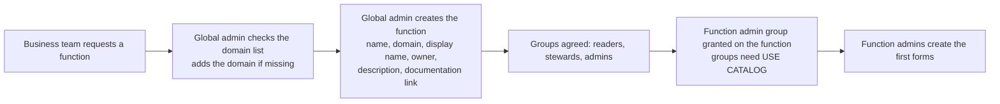
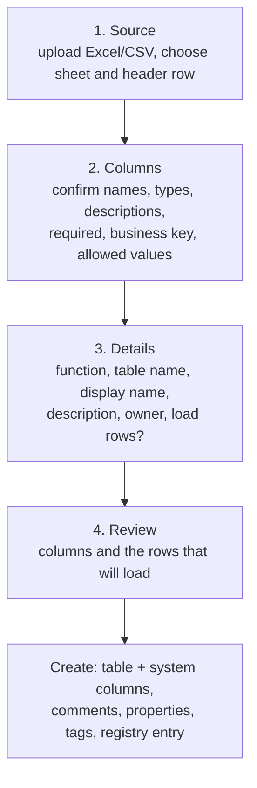
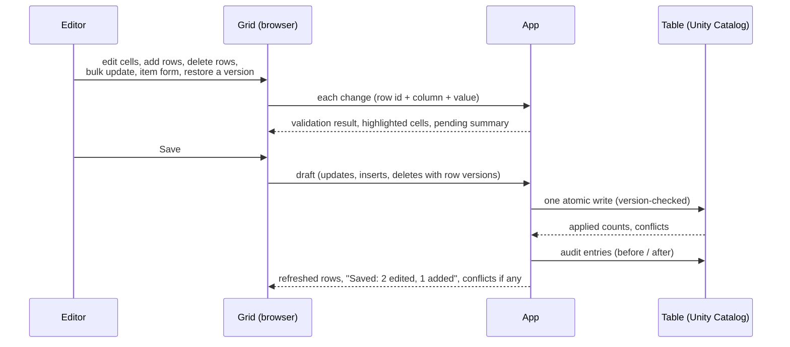
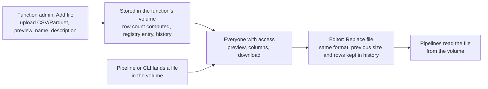
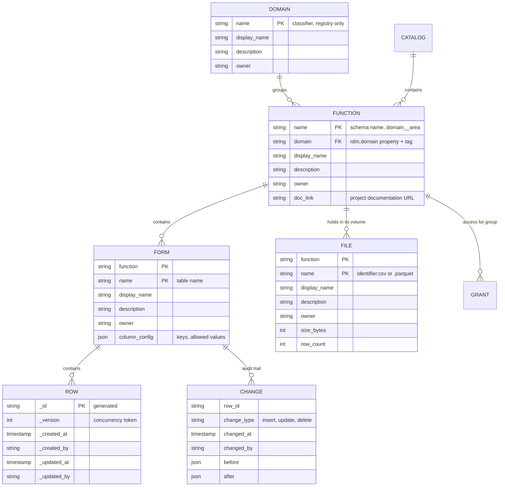
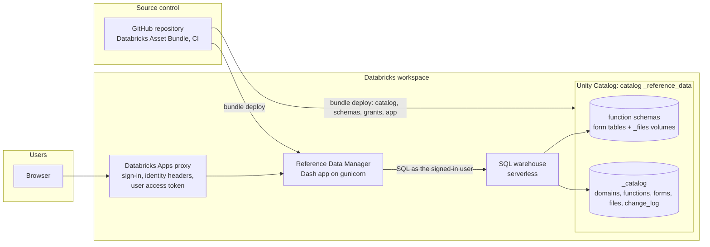

# Reference Data Manager - Functional Design

| | |
|---|---|
| Status | Working draft, maintained with the code |
| Audience | Business owners, data stewards, data engineers and contributors |
| Related | [DESIGN.md](DESIGN.md) (technical architecture), [DEPLOYMENT.md](DEPLOYMENT.md) (Databricks setup), [FRAMEWORK_DECISION.md](FRAMEWORK_DECISION.md) (UI framework), in-app **Help** |

## 1. Purpose and scope

The Reference Data Manager (also called the SCD Manager) is the single place where business
users maintain the organisation's reference data: code lists, mappings, hierarchies and
other slowly changing reference tables that today live in SharePoint lists and spreadsheets.

It replaces those lists with governed tables in the Databricks lakehouse while keeping the
experience business users know: a searchable catalogue of lists, an editable grid, Excel
in and out, and a clear record of who changed what.

In scope

* Creating, editing and retiring reference lists ("forms") per business function, with the
  functions grouped into the organisation's data domains.
* Keeping large reference datasets (thousands to millions of rows) as governed **files**
  (CSV or Parquet) in the same hierarchy, with preview, download, replace and history
  instead of row-by-row editing.
* Access by role, granted to groups, enforced by Unity Catalog.
* Full change history (per form and per row, with restore; per file per upload) and a
  registry of every domain, function, form and file for the data catalogue.
* Feeding downstream pipelines that build slowly changing dimensions.

Out of scope

* Editing high-volume datasets row by row (the grid is designed for lists of up to a few
  thousand rows; the row limit is configurable). Larger datasets are kept as files, which are
  replaced as a whole.
* Approval workflows and notifications: a saved change takes effect immediately and is
  attributable through the history. Organisations that need sign-off keep it in their
  business process, outside the app.
* Lookup columns that reference another form: relationships between lists are documented in
  the column descriptions and validated downstream.
* Effective dating as a built-in feature: the app tracks *who changed what and when* through
  its own audit columns and history; lists that carry business validity dates define them as
  ordinary columns.
* Building the Type 2 dimensions themselves; the app supplies the current state and the
  change feed, pipelines derive history.

## 2. Business context

**Problem.** Reference data is spread over SharePoint lists and personal spreadsheets. It is
copied into the data platform by hand, ownership is unclear, changes are not traceable and
the lists cannot be joined reliably with lakehouse data.

**Goals**

| Goal | Measure |
|---|---|
| One governed home for reference data | Every list has a domain, a function, an owner and a description in the catalogue |
| Business users maintain their own lists | Editors change rows without a data engineer; new lists are created from Excel by function admins |
| Trustworthy history | Every change is attributable (who, when, before, after); no silent overwrites; any version of a row can be restored |
| Platform-native governance | Access is Unity Catalog grants to groups; nothing is enforced by the app alone |
| Downstream reuse | Pipelines read the tables directly and build SCD Type 2 from the change feed |

**Stakeholders**

| Stakeholder | Interest |
|---|---|
| Business teams (Finance, HR, Student services, Research, ...) | Own and maintain their lists |
| Data stewards | Data quality of the lists, descriptions, keys and allowed values |
| Data engineering (platform team) | Operates the app, the catalog and the pipelines; acts as global administrator; maintains the domain list |
| Analytics and reporting | Consume current values and history |

## 3. Glossary

The hierarchy is **domain > function > form | file**.

| Term | Meaning |
|---|---|
| **Catalog** | The Unity Catalog catalog that holds all reference data (`_reference_data`). |
| **Domain** | A business classifier at the top of the hierarchy, aligned with the organisation's data domains (the classification Databricks calls *domains*), e.g. *Student*, *Finance*, *People*. Groups functions. Maintained by global admins in the registry; not a Unity Catalog securable. |
| **Function** | A business function or area, e.g. *Finance - Cost Management*. One Unity Catalog schema; belongs to one domain. Roles are held on functions. |
| **Form** | One reference list, e.g. *Cost Centres*. One Delta table in a function; edited row by row in a grid. |
| **File** | One reference dataset too large for a grid, e.g. *GL Transactions*. One CSV or Parquet file in the function's volume; previewed, downloaded and replaced as a whole. |
| **Volume** | The Unity Catalog volume `_files` the app creates in every function schema to hold its files. |
| **Row** | One entry of a list. Identified technically by `_id`; identified for people by the business key. |
| **Business key** | The column(s) that identify a row for users (a code). The app refuses duplicates. |
| **Allowed values** | A fixed list of permitted values for a text column; shown as a dropdown. |
| **Required** | A column that must always have a value. |
| **System columns** | Columns the app manages on every form: `_id`, `_version`, `_created_at/by`, `_updated_at/by`. |
| **Registry** | Tables `_catalog.domains`, `_catalog.functions`, `_catalog.forms` and `_catalog.files` describing every domain, function, form and file (display name, description, owner, documentation link; size and row count for files). |
| **Audit trail** | Table `_catalog.change_log` with one entry per changed row and save (and per file upload, replacement or deletion); the source of the History tabs, the per-row history and restore. |
| **Draft** | The unsaved changes of one user on one form (cell edits, added and deleted rows, bulk updates, item-form edits, restored versions). Written in one save. |
| **Viewer / Editor / Function admin / Global admin** | The four roles, see §4. |
| **SCD** | Slowly changing dimension. The app maintains the current state (Type 1); pipelines derive Type 2 history from the change feed. |

## 4. Actors and roles

Roles are held on a function (schema) except Global admin, which is held on the catalog.
Access is always granted to a **group**, never to an individual account.

| Role | Held on | Can |
|---|---|---|
| **Viewer** | function | Open the function's forms and files, search, sort, filter, open a row in the item form, export to CSV/Excel, preview and download files, read history |
| **Editor** | function | Viewer + add, change and delete rows, bulk-update selected rows, import rows from Excel/CSV, restore earlier versions of rows, replace the content of files |
| **Function admin** | function | Editor + create forms (from Excel or from scratch), change column descriptions and rules, add/remove columns, add files and edit their details, edit function details, grant roles on the function to groups |
| **Global admin** | catalog | Everything in every function + create and delete functions, assign functions to domains, maintain the domain list, delete forms and files, read the administration guide |

Typical mapping: `<function>_readers` = Viewer, `<function>_stewards` = Editor,
`<function>_admins` = Function admin, the data platform group = Global admin.

Permission matrix

| Capability | Viewer | Editor | Function admin | Global admin |
|---|---|---|---|---|
| Browse, search, export, item form, history, preview and download files | yes | yes | yes | yes |
| Edit / add / delete rows, bulk update, import rows, restore versions, replace files | | yes | yes | yes |
| Create form, edit form definition and details; add files, edit file details | | | yes | yes |
| Edit function details, grant roles on the function | | | yes | yes |
| Delete form, delete file, delete function | | | | yes |
| Create function, assign a function to a domain | | | | yes |
| Maintain the domain list | | | | yes |
| Administration guide (technical documentation) | | | | yes |

Locally the persona switcher offers one user per role (Global admin, Function admin,
Editor, Viewer) so that every screen can be exercised without a workspace.

## 5. Functional requirements

Status: **done** = implemented and tested; **planned** = agreed, not built.

| Id | Requirement | Status |
|---|---|---|
| FR-01 | Show only the domains, functions and forms the signed-in user may see, with their role. | done |
| FR-02 | Search forms by name, description or owner; filter every list in the app by text. | done |
| FR-03 | Every form has a bookmarkable address. | done |
| FR-04 | Editable grid: inline editing, dropdowns for allowed values, add row, delete selected rows, undo, sort/filter while editing, server-side search. | done |
| FR-05 | Validate before saving: required values, types, allowed values, unique business keys; highlight the cell and list the problem; block Save until clean. | done |
| FR-06 | Save all pending changes at once; nothing is written while problems remain. Pending changes survive switching between the form's tabs. | done |
| FR-07 | Detect concurrent edits: a row changed by someone else since it was loaded is not overwritten; the user is told which rows to redo. | done |
| FR-08 | Export what is shown (CSV) or the whole list (Excel). | done |
| FR-09 | Import rows from Excel/CSV into an existing form; headers matched by name; invalid cells reported; existing rows never modified. | done |
| FR-10 | Full history per form: who, when, added/edited/deleted, values before and after, searchable. | done |
| FR-11 | Create a form from an Excel file: infer column names and types, let the admin adjust names, types, descriptions, required, business key, allowed values; optionally load the rows. | done |
| FR-12 | Create a form from scratch by defining columns by hand. | done |
| FR-13 | Change a form's definition later: descriptions, required, business key, allowed values, add/remove columns. Types and names are fixed once created. | done |
| FR-14 | Form details: display name, description, owner. | done |
| FR-15 | Functions carry display name, description, owner, a project documentation link and their domain; all recorded in the registry. | done |
| FR-16 | Global admins create functions from the app (also possible through the asset bundle). | done |
| FR-17 | Function admins grant Viewer/Editor/Function admin to groups from the function page; individuals are rejected; group names are searchable. | done |
| FR-18 | In-app help: user guide, form-building guide; administration guide visible to global admins only. | done |
| FR-19 | The user's effective access is visible at all times (sidebar summary, role badges). | done |
| FR-22 | Bulk update of selected rows: set one column to the same value (or clear it) on every selected row, validated and saved with the other pending changes. | done |
| FR-24 | Item form: one row in a dialog with one input per column, for wide lists; shows the row's own history and restores any earlier version into the pending changes. Deleted rows are restored from the History tab. | done |
| FR-25 | Hierarchy domain > function > form: every function belongs to a domain; the sidebar and the home page group functions by domain. | done |
| FR-26 | Global admins maintain the domain list (create, edit, delete when no function is assigned) and assign functions to domains. | done |
| FR-27 | Only global admins delete functions (when empty) and forms; function admins create and change but never delete. | done |
| FR-28 | A local persona for the Function admin role, next to Global admin, Editor and Viewer. | done |
| FR-29 | Files: a function holds CSV/Parquet datasets next to its forms, with display name, description, owner, size and row count in the registry; preview of the first rows, inferred columns, download; editors replace the content, function admins add files, global admins delete them; every upload, replacement and deletion is in the history. | done |
| FR-30 | Files landed in the function's volume outside the app (pipelines, CLI) are shown automatically, marked unregistered until an admin describes them; the browser upload has a configurable size limit. | done |
| FR-31 | The catalog is named `_reference_data` (it holds forms and files, not only forms). | done |

Removed requirements (decided in review, see §1 *Out of scope*): FR-20 effective-dating
columns, FR-21 lookup columns and dependent dropdowns, FR-23 approval step with
notifications. The ids are not reused.

## 6. Business processes

### 6.1 Onboarding a domain and a function

The domain list is kept aligned with the organisation's data domains. The function name
follows `<domain>__<area>` (double underscore), for example `finance__cost_management`. It
becomes the schema name and cannot change; the display name and the domain assignment can.

### 6.2 Creating a form from Excel

Rules applied at creation: names are normalised to `lower_snake_case`; types come from a
portable set (text, whole number, decimal, floating point, yes/no, date, date-time); rows
that do not match the chosen types are left empty and listed; low-cardinality text columns
get a suggested allowed-value list the admin can keep, edit or clear.

### 6.3 Maintaining a list

Every way of changing rows ends in the same draft: cell edits in the grid, **Add row**,
**Delete selected**, **Bulk update** (one column, one value, all selected rows), the **item
form** (one row in a dialog) and **Restore** (an earlier version of a row). The draft is
validated as a whole and written in one save; it survives switching to the History, Schema
or Settings tab.

Conflict rule: a row carries `_version`; an update or delete is applied only if the row's
version is still the one the user loaded. Otherwise the change is skipped and reported; the
user sees the current values and decides.

### 6.4 Bulk import

Editor uploads a file -> headers are matched to column names (case, spaces and punctuation
ignored) -> rows are converted to the column types -> problems are listed -> **Append**
inserts every row as new (business keys are not used to update existing rows). To change
existing rows in bulk, select them and use **Bulk update**, or export, change and re-import
into a fresh form.

### 6.5 Changing a form definition

Function admin opens the **Schema** tab: descriptions, required flags, business keys and
allowed values are edited in place and saved together; **Add column** adds an optional
column; **Remove column** requires typing the column name. Changing a column's type or name
is not offered: create a new column, migrate values, remove the old one. Every change is
recorded on the table (comments, properties) and in the registry.

### 6.6 Granting access

Function admin opens the function page -> **Access** -> searches a group -> chooses Viewer,
Editor or Function admin -> **Grant**. The app replaces the group's app-managed privileges
on the schema and reports the result. **Revoke** removes them. Global admins can do the
same on any function and through the asset bundle for initial setup.

### 6.7 Reviewing history and restoring a version

Anyone with access opens **History** on a form: one line per changed row and save, newest
first, with who, when, the kind of change, the fields changed and the row values (after the
change for edits and additions, before the change for deletions). The list is searchable.

For one row, **Open row** shows the item form with the row's own history. **Restore** next
to a version stages that version's values on the row; the change is reviewed and saved like
any other. A deleted row is restored from the History tab (tick the deletion, **Restore
selected version**): it comes back as a new row with the old values and a new `_id`.

### 6.8 Retiring a form or a function

Only global admins delete. A form is deleted from its **Settings** tab with a typed
confirmation (Delta keeps the table recoverable for the retention period; the audit entries
are kept). A function is deleted from its page once it holds no forms; its grants and
registry entry go with it. A domain is deleted from the **Domains** page once no function is
assigned to it.

### 6.9 Managing a file

Files are the answer for reference datasets that are too large for a grid (thousands to
millions of rows): the same domain > function hierarchy, the same roles, the same registry
and history, but no row-by-row editing. A file is replaced as a whole. Files that arrive in
the volume by other means (a pipeline, the Databricks CLI) appear on the function page as
*not registered* until a function admin gives them a display name and description.

### 6.10 Feeding slowly changing dimensions

The form table is the **current state** (Type 1). Change Data Feed is enabled on every form;
a Lakeflow / Delta Live Tables pipeline reads the feed (`table_changes`) and applies it as
SCD Type 2 to a dimension table in the analytics layer. `_updated_at` and `_updated_by`
travel with every row so the dimension can show who made the change effective.

## 7. Data design

### 7.1 Conceptual model

### 7.2 Where each piece of information lives (Databricks)

| Information | Location | Why |
|---|---|---|
| Domain list (name, display name, description, owner) | `_catalog.domains` | Domains are a classifier, not a securable; the registry is the single list global admins maintain |
| Function's domain | schema `DBPROPERTIES` (`rdm.domain`), schema tag `rdm_domain`, `_catalog.functions` | The property is canonical; the tag is visible and searchable in Catalog Explorer, where it can be aligned with the workspace's domain classification |
| Function description | schema `COMMENT` | Visible in Catalog Explorer and to every tool |
| Function display name, owner, documentation link | schema `DBPROPERTIES` (`rdm.*`), schema tags, `_catalog.functions` | Properties are canonical; tags are searchable; the registry is one table for reporting |
| Form description | table `COMMENT` | Same |
| Form display name, owner, column rules (keys, allowed values) | `TBLPROPERTIES` (`rdm.display_name`, `rdm.owner`, `rdm.column_config`), tags, `_catalog.forms` | Same |
| File content | Unity Catalog volume `<catalog>.<function>._files` | Files are read by pipelines and tools directly from the volume; the app moves them with the Files API as the signed-in user |
| File display name, description, owner, size, row count | `_catalog.files` | Volumes carry no properties; the registry is the single description |
| Column description, required | column `COMMENT`, `NOT NULL` | Native, enforced by the table |
| Row identity and audit | system columns on every form | Travel with the data into every consumer |
| Change history | `_catalog.change_log` (+ Delta Change Data Feed) | Queryable audit trail independent of Delta log retention; source of per-row history and restore |
| Access | Unity Catalog grants on the schema (groups) | Enforced by the platform |

### 7.3 Conventions

* Names: `lower_snake_case`, letters, digits and underscores, starting with a letter;
  functions use `<domain>__<area>`; domains are short single words (`student`, `finance`);
  file names are `<identifier>.csv` or `<identifier>.parquet`; names starting with `_` are
  reserved for the app (the `_files` volume, the `_catalog` schema).
* Types: `STRING`, `INTEGER` (BIGINT), `DECIMAL(p,s)` (default 18,4), `DOUBLE`, `BOOLEAN`,
  `DATE`, `TIMESTAMP`. Tables created outside the app with other types are shown read-only.
* Every form created by the app has the six system columns and a primary key on `_id`.
* Timestamps are stored in UTC.

### 7.4 Data quality rules

| Rule | Where enforced |
|---|---|
| Required columns cannot be empty | App validation and `NOT NULL` on the table |
| Values must match the column type | App conversion (grid, bulk update, item form, import); the table rejects the rest |
| Allowed values | App validation (dropdown in the grid and the item form, check on bulk update and import) |
| Business key uniqueness | App validation against the loaded rows and the draft; informational primary key on `_id` |
| No silent overwrite of another person's change | `_version` check on every update and delete |
| Attributable changes | `_updated_by` / `_created_by` set from the signed-in identity; audit entries per row |
| A function belongs to an existing domain | App validation against the domain list when a function is created or reassigned |
| A file is readable as CSV or Parquet | The backend counts its rows with the platform reader on upload; unreadable uploads are rejected |

### 7.5 Data lifecycle

| Event | What happens |
|---|---|
| Domain created / edited | Registry row added / updated |
| Function created | Schema created with comment, properties (incl. domain), tags; registry row added |
| Form created | Table created with comments, properties, tags, Change Data Feed, column mapping; registry row added; rows loaded (each logged as an insert) |
| Rows changed | One atomic write; audit entries; `_version` incremented |
| Version restored | Staged as ordinary row changes (or a new row for a deleted one); saved and logged like any edit |
| Definition changed | Table altered (comments, NOT NULL, columns); registry updated |
| File added / replaced | File written to the function's volume; size and row count recorded in the registry; audit entry (previous size and rows kept) |
| File deleted (global admin) | File removed from the volume; registry row removed; audit entries kept |
| Form deleted (global admin) | Table dropped (Delta keeps it recoverable for the retention period); registry row removed; audit entries kept |
| Function deleted (global admin) | Refused while forms or files exist; empty volume and schema dropped, grants and registry row removed |
| Domain deleted (global admin) | Refused while functions are assigned; registry row removed |

## 8. Technology design (high level)

### 8.1 Databricks deployment

Key choices

* **The app runs SQL and file operations as the signed-in user** (Databricks Apps user
  authorization, scopes `sql` and `files.files`). Unity Catalog is the enforcement point; the
  app only decides what to show. Roles are read from the catalog's `information_schema`
  inside the user's session.
* **Files stay files.** A file is a Unity Catalog volume object read with `read_files`;
  the app never loads it into a table, so pipelines and notebooks read the same bytes the
  steward uploaded.
* **Grants go to groups.** The app validates group names and issues `GRANT`/`REVOKE` on the
  schema; the asset bundle seeds the initial catalog, `_catalog` schema, functions and grants.
* **Domains are metadata.** The domain list lives in the registry; each function's domain is
  a schema property and tag, so the classification is visible in Catalog Explorer and can be
  mirrored to the workspace's own domain classification.
* **One atomic write per save** (a single `MERGE` fed by one JSON parameter), so a save
  either happens or does not, and retrying is safe.
* **Infrastructure as code.** Catalog, schemas, grants and the app are declared in
  `databricks.yml` / `resources/*.yml`; GitHub Actions lint, test and deploy.
* **Serverless SQL warehouse** recommended: interaction latency is dominated by statement
  round-trips.

### 8.2 Application structure

The user interface (Dash with an AG Grid data grid) never contains SQL. It calls services
(navigation, validation, drafts, Excel import), which call a **backend interface**. Two
backends implement it:

| Backend | Use |
|---|---|
| Databricks SQL warehouse | Production and workspace testing |
| DuckDB (local file) | Local development and the automated test suite; see §8.4 |

### 8.3 Non-functional characteristics

| Aspect | Design position |
|---|---|
| Volume | Lists up to a few thousand rows per form (grid page limit `RDM_MAX_ROWS`, default 5,000); server-side search for the rest. Larger datasets as files: any size in the volume, `RDM_MAX_FILE_MB` (default 200) through the browser |
| Concurrency | Many users may edit the same list; row-level version checks prevent lost updates; Delta deletion vectors reduce write conflicts |
| Latency | One or two warehouse statements per action; metadata cached per user for a short time |
| Security | Identity from the Databricks proxy; SQL parameters everywhere; identifiers validated; no secrets in code |
| Auditability | Audit table plus Delta history and Change Data Feed |
| Recoverability | Any version of a row restorable from the app; Delta time travel on every table; dropped tables recoverable within retention |
| Availability | Stateless app; a restart loses no data (drafts live in the browser until saved) |

### 8.4 Side note: DuckDB for local development

DuckDB is a single-file database that gives the same SQL surface the app needs (schemas,
tables, comments, transactions) with no infrastructure. Locally the app runs against
`data/rdm.duckdb` with four demo domains, three functions and a persona switcher (Global
admin, Function admin, Editor, Viewer) so that every screen can be exercised offline.
Anything Unity Catalog has and DuckDB lacks (properties, tags, grants, the change feed) is
emulated in the local `_catalog` schema. It is a development aid, not a deployment target:
the Databricks backend is validated by SQL generation tests and, before releases, by running
against a development catalog.

## 9. Operations

| Topic | Practice |
|---|---|
| Environments | Bundle targets `dev` (developer-prefixed schemas, separate catalog) and `prod` |
| Releases | Pull request -> CI (lint, tests) -> merge -> `bundle deploy -t prod` |
| Support | Global admins (data platform team); in-app Help for users; owner shown on every function and form |
| Monitoring | App logs in the Databricks Apps console; warehouse query history; `_catalog.change_log` for usage |
| Backup | Delta time travel and Change Data Feed; audit table retained indefinitely |

## 10. Roadmap and open points

* Mirroring the app's domain assignment onto the workspace's native domain classification
  automatically (today: the `rdm_domain` tag makes it visible; the alignment is done in
  Catalog Explorer).
* Multi-cell paste from Excel is not available in the community data grid; bulk update and
  import cover bulk changes today.
* A guided "retire function" that migrates or archives its forms before the schema is dropped.
* Pending feedback from the review rounds is tracked in the pull request.
